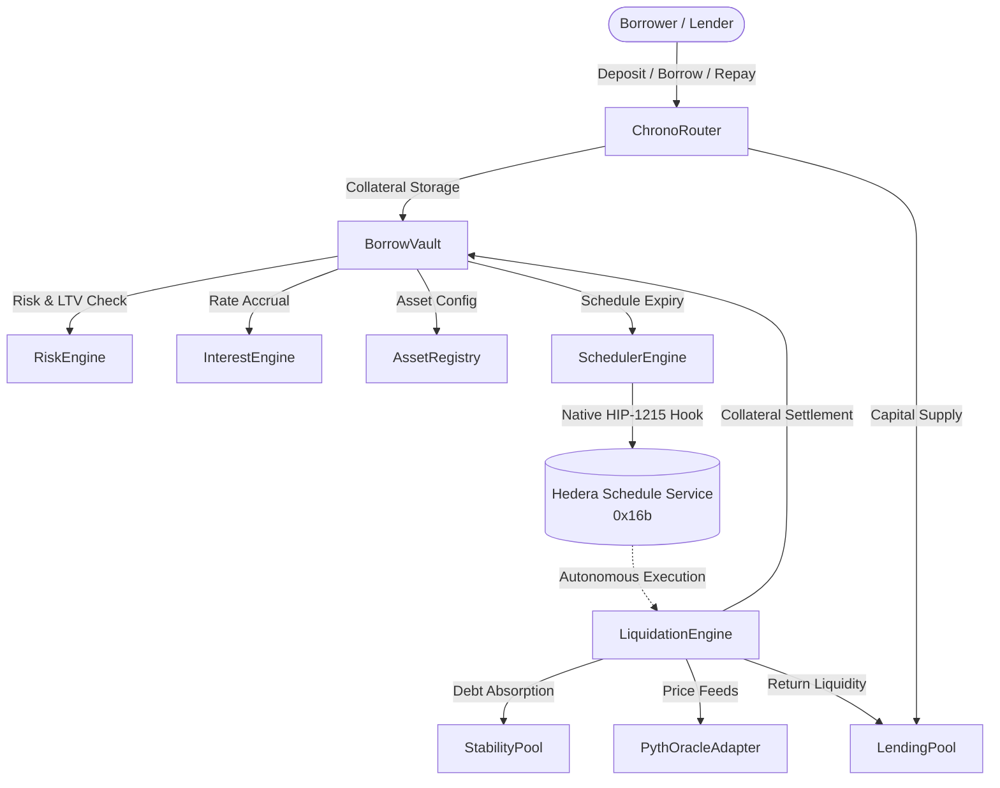

# Chrono Protocol

<p align="center">
  
</p>

<h3 align="center">The Duration-Bound Money Market on Hedera</h3>

<p align="center">
  <em>"The shorter you borrow, the more you can borrow."</em>
</p>

<p align="center">
  <a href="https://hashscan.io/testnet"></a>
  <a href="https://github.com/hiero-ledger/hiero-contracts"></a>
  <a href="#"></a>
  <a href="#"></a>
  <a href="LICENSE"></a>
</p>

---

## ⚡ Overview

Traditional money markets (**Aave**, **Compound**, **Morpho**) treat risk statically: a 10-minute arbitrage borrow is subjected to the exact same conservative Loan-to-Value (LTV) cap as a 6-month speculative loan.

**Chrono Protocol** fundamentally alters this paradigm by introducing **duration-bound borrowing**. Rooted in quantitative risk-time equivalence ($\text{Risk} = \sigma \cdot \sqrt{t}$), Chrono mathematically exploits the narrow variance window of shorter loans to unlock **up to $10\times$ leverage (90% LTV)** for short-term borrowers while enhancing overall protocol solvency.

Positions enforce terminal execution through **Hedera Schedule Service (HSS / HIP-1215)** native autonomous scheduled transactions — eliminating third-party liquidator keeper bounties, MEV searcher front-running, and off-chain execution latency.

---

## 📊 The Numbers Unlocked by Chrono

| Metric | Traditional Money Markets (Aave / Compound) | Chrono Protocol | Impact / Unlock |
| :--- | :---: | :---: | :--- |
| **Max Allowable LTV** | Static 70% – 75% | **Up to 90.0% Dynamic LTV** | **$+1500\text{ bps}$ capital efficiency** for short-term borrowers |
| **Maximum Leverage** | $3.3\times$ – $4.0\times$ | **Up to $10.0\times$ Leverage** | **$2.5\times$ more borrowing power** on 1-hour durations |
| **Hard Liquidation Trigger** | Manual bot / Off-chain keeper | **100% Autonomous (HSS / 0x16b)** | **Zero keeper dependency**, immune to mempool spikes |
| **Soft Liquidation Bonus** | Static 5% – 10% penalty | **Continuous Dutch Auction (CD3)** | **$0$ toxic MEV front-running**, fair market price discovery |
| **Compounding Precision** | Taylor Series truncation | **PRBMath UD60x18 $\exp(rt)$** | **$+27.72\%$ precision error eliminated** at high APY regimes |
| **Transaction Latency & Cost** | 12s blocks, volatile gas spikes | **3.2s finality, <$0.001 fixed fee** | High-frequency collateral management on **Hedera** |

---

## 🧠 Core Philosophy & Risk-Time Equivalence

In quantitative finance, asset price dispersion scales with the square root of elapsed time:

$$\text{Risk} = \sigma \cdot \sqrt{t}$$

- Over **1 hour**, the expected standard deviation of asset price movement is tiny.
- Over **1 day** ($24\times$ longer), risk is only $\sqrt{24} \approx 4.9\times$ larger.
- Over **7 days**, risk is $\sqrt{168} \approx 13.0\times$ larger than a 1-hour window.

Because price variance is disproportionately compressed over short time horizons, **a 1-hour loan is significantly safer than a 30-day loan**. Chrono reflects this mathematical truth directly in its dynamic borrowing curve:

$$\text{LTV}(t) = \text{LTV}_{\text{base}} + (\text{LTV}_{\text{max}} - \text{LTV}_{\text{base}}) \cdot e^{-k \cdot t}$$

```
Max LTV
  100% │
   90% │● (10x Leverage @ 1h)
       │ ╲
   85% │  ╲ (7.7x Leverage @ 12h)
       │   ╲
   80% │    ╲ (6.25x Leverage @ 24h)
       │     ╲─────────────────────────────── Baseline LTV (75% / 4x @ 7d+)
   70% │
       └──────────────────────────────────────── Duration (t)
       0h   12h   24h         7d           30d
```

### Calibrated Leverage Schedule

| Duration | Max LTV | Leverage | Core Use Cases |
| :--- | :---: | :---: | :--- |
| **1 Hour** | **90.0%** | **$10.0\times$** | DEX arbitrage, flash-loan alternatives, liquidation bridges, automated rebalancing |
| **12 Hours** | **87.0%** | **$7.7\times$** | Intraday momentum trading, event-driven hedging, news-cycle exposure |
| **1 Day** | **84.0%** | **$6.25\times$** | Daily yield harvesting, cross-venue collateral farming, delta-neutral spreads |
| **7 Days** | **75.0%** | **$4.0\times$** | Multi-day swing positions, traditional DeFi collateralized borrowing |
| **30 Days** | **75.0%** | **$4.0\times$** | Conservative medium-term liquidity financing |

---

## 🛡️ Dual-Liquidation Architecture

Chrono protects protocol solvency through two decoupled, complementary liquidation paths:

```
[Borrow Position Created]
          │
          ├───► [Price Drop (HF <= 1.0)] ────► [Soft Liquidation / Dutch Auction Engine (CD3)]
          │                                     • Clears via Euler-inspired continuous discount
          │                                     • Auction starts +2% above oracle; zero toxic MEV
          │                                     • Closes debt partially; restores position health
          │
          └───► [Time Reaches T_expiry]  ────► [Hard Liquidation / Hedera Scheduled Transaction]
                                                • 100% autonomous trigger via HSS (0x16b)
                                                • Settles via Stability Pool (Liquity-style O(1))
                                                • Dual-Tranche penalty: 75% to SP, 25% to Reserve
                                                • Solvency-gated surplus collateral refund
```

### 1. Soft Liquidation (Solvency Default: $HF \le 1.0$)
- **Mechanism**: Euler-inspired continuous Dutch Auction with the **Chrono Dynamic-Discount Engine (CD3)**.
- **Fair Price Discovery**: The auction starts with a $+2\%$ premium above oracle price and decays smoothly downwards. Liquidators compete on price rather than transaction ordering, eliminating toxic priority gas wars (PGA) and MEV censorship.
- **Equity Preservation**: The borrower loses only what the market clears at, preserving residual equity.

### 2. Hard Liquidation (Duration Expiration: $t \ge T_{\text{expiry}}$)
- **Autonomous Settlement**: Invoked natively by the Hedera Schedule Service at the position's exact expiration timestamp.
- **3-Tier Settlement Waterfall**:
  1. **Lender Invariant**: 100% debt repaid to `LendingPool` via `returnBorrowLiquidity`.
  2. **Dual-Tranche Penalty Split**: 12% default penalty (calibrated with a 2.5% collateral floor) split 75% to `StabilityPool` depositors and 25% to the Protocol Reserve.
  3. **Solvency-Gated Surplus Remittance**: Surplus collateral is refunded to the borrower if and only if `stabilityPool.canAbsorb == true`. If the Stability Pool is under-capitalized, surplus remains locked and collateral is seized to the protocol recovery reserve.
  4. **15-Minute HSS Grace Window**: 900-second buffer absorbs Hedera consensus timestamp jitter; a 1.5% late fee applies if repaid during grace.

---

## 🔬 Coming Soon: Novel Stochastic Interest Rate Model (IRM)

While Chrono's current engine employs a continuous dual-kink piecewise curve with a **Global Cumulative Borrow Index ($I_t$)**, active development is underway on a **continuous stochastic PID-controlled IRM**:

- **Continuous Volatility Adaptation**: Adjusts interest rates not merely on static utilization snapshots ($U$), but dynamically incorporates utilization velocity ($\frac{dU}{dt}$) and trailing asset volatility drift.
- **Kink Elimination**: Removes arbitrary piecewise thresholds, generating smooth, predictable borrowing costs that protect against large-borrow rate manipulation.
- **Zero Retroactive Exploits**: Eliminates the "time-machine" rate manipulation vulnerability common to discrete multi-position money markets.

---

## 🏗️ System Architecture



---

## 📍 Testnet Deployments (Hedera Testnet — Chain ID: 296)

All core protocol contracts are deployed and verified on Hedera Testnet:

| Contract | Address | Explorer Link |
| :--- | :--- | :--- |
| **`BorrowVault`** | `0x7742d8C4CE85CC901718B9513cdBf54e78a641EC` | [HashScan](https://hashscan.io/testnet/contract/0x7742d8C4CE85CC901718B9513cdBf54e78a641EC) |
| **`LendingPool`** | `0x5B05F8dF74eee9BC8703e9517A52539b2d5d9BDB` | [HashScan](https://hashscan.io/testnet/contract/0x5B05F8dF74eee9BC8703e9517A52539b2d5d9BDB) |
| **`StabilityPool`** | `0xd8BfcaC348093aC49EDfD4013c3693fD5c3fafBa` | [HashScan](https://hashscan.io/testnet/contract/0xd8BfcaC348093aC49EDfD4013c3693fD5c3fafBa) |
| **`ChronoRouter`** | `0x5B0110008792efb6CC4B4fa1Cf345CF024F4F2Da` | [HashScan](https://hashscan.io/testnet/contract/0x5B0110008792efb6CC4B4fa1Cf345CF024F4F2Da) |
| **`LiquidationEngine`** | `0xa73284912422aad12764d7c7922920cf5906cbF5` | [HashScan](https://hashscan.io/testnet/contract/0xa73284912422aad12764d7c7922920cf5906cbF5) |
| **`SchedulerEngine`** | `0x38167c3F80d2684B7eE7192e24b11a8015399558` | [HashScan](https://hashscan.io/testnet/contract/0x38167c3F80d2684B7eE7192e24b11a8015399558) |
| **`AssetRegistry`** | `0x66852201732a4D4CD994a12Ec50425733a8aD924` | [HashScan](https://hashscan.io/testnet/contract/0x66852201732a4D4CD994a12Ec50425733a8aD924) |
| **`InterestEngine`** | `0x35457D520d7E0A1E8446Eba8044d910a8ABD3d4c` | [HashScan](https://hashscan.io/testnet/contract/0x35457D520d7E0A1E8446Eba8044d910a8ABD3d4c) |
| **`RiskEngine`** | `0xA081a818F81293dF402cCE38181A3c7b74b37bFc` | [HashScan](https://hashscan.io/testnet/contract/0xA081a818F81293dF402cCE38181A3c7b74b37bFc) |
| **`PythOracleAdapter`** | `0x1C15A0852cdd0C466bb5006f7a49d91fbE7527e7` | [HashScan](https://hashscan.io/testnet/contract/0x1C15A0852cdd0C466bb5006f7a49d91fbE7527e7) |
| **`WrappedTokenFactory`** | `0x9E88Cdd088C76375Db8Ab7135d43429fBa1D6E2C` | [HashScan](https://hashscan.io/testnet/contract/0x9E88Cdd088C76375Db8Ab7135d43429fBa1D6E2C) |
| **`wUSDC` (HTS)** | `0x000000000000000000000000000000000098a590` | [HashScan](https://hashscan.io/testnet/token/0.0.10003856) |
| **`wETH` (HTS)** | `0x000000000000000000000000000000000098a593` | [HashScan](https://hashscan.io/testnet/token/0.0.10003859) |
| **`wBTC` (HTS)** | `0x000000000000000000000000000000000098A597` | [HashScan](https://hashscan.io/testnet/token/0.0.10003863) |

---

## 🚀 Quickstart & Development

### Prerequisites
- [Node.js](https://nodejs.org/) `>= 18.0.0`
- [npm](https://www.npmjs.com/) or `pnpm`

### Installation
```bash
git clone https://github.com/LordRyuga/Chrono_hedera.git
cd Chrono_hedera
npm install
```

### Compile Smart Contracts
```bash
npx hardhat compile
```

### Run Test Suite (66 Unit & Integration Tests)
```bash
npx hardhat test
```

### Deploy to Hedera Testnet
```bash
npx hardhat run scripts/deploy/deploy.ts --network testnet
```

### Seed Protocol Liquidity
```bash
npx hardhat run scripts/seed.ts --network testnet
```

### Run Frontend & Backend
```bash
# Start Backend Relayer & Indexer (port 3001)
cd chrono-web/backend
npm install
npm run dev

# Start Frontend UI (port 5173)
cd ../
npm install
npm run dev
```

---

## 📚 Deep Dive & Documentation

- 📘 [**Chrono Protocol Primer (Non-Technical)**](docs/Chrono_Primer.md): Intuitive, step-by-step primer explaining duration risk, Dutch auctions, and overcollateralization from scratch.
- 📑 [**Chrono Protocol Whitepaper**](docs/Chrono_Protocol_Whitepaper.md): Mathematical formulations, dynamic decay functions, and risk models.
- 📐 [**Hard Liquidation Specification**](docs/Chrono_Hard_Liquidation_Specification.md): 3-tier settlement waterfall, dual-tranche penalty accounting, and grace window jitter proofs.
- 🧪 [**Hard Liquidation Test Verification Report**](docs/test_reports/hard_liquidation_test_report.md): Invariant proofs and end-to-end integration test runs.
- ⚖️ [**Soft Liquidation Dutch Auction Analysis (CD3)**](docs/analysis/SOFT_LIQUIDATION_DUTCH_AUCTION_ANALYSIS.md): Architectural evaluation comparing Euler v2, Morpho Blue, and Chrono Dynamic-Discount Engine.
- 📈 [**Interest Rate & Utilization Analysis**](docs/analysis/INTEREST_RATE_UTILIZATION_ANALYSIS.md): Mathematical proofs of pre-borrow vs. post-borrow rate dynamics and integral pricing.

---

## 📄 License

This project is licensed under the [MIT License](LICENSE).