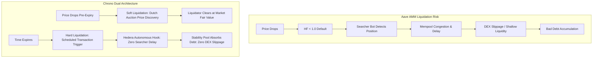

# Comparative Analysis: DeFi Risk Parameterization & Capital Efficiency Methodologies

**Document:** DeFi Risk Parameterization Comparative Research  
**Target Path:** `docs/analysis/DEFI_RISK_PARAMETERIZATION_ANALYSIS.md`  
**Status:** Final Document (Verified & Approved)  
**Author:** Chrono Protocol Research & Risk Engineering  
**Scope:** Mathematical risk modeling across Aave (Chaos Labs / Gauntlet), Morpho Blue, Liquity v1/v2, and calibration of Chrono Protocol's duration-bound borrowing model.

---

## 1. Executive Summary

### 1.1 Objective & Problem Statement
Decentralized lending protocols must balance two competing objectives: maximizing capital efficiency (higher allowable Loan-to-Value, or LTV) and preventing protocol insolvency (protecting lenders from bad debt caused by liquidation failures) [^1]. Traditional protocols treat debt positions as perpetual, applying static LTV caps that assume indefinite downside exposure [^2]. 

This report investigates the mathematical risk methodologies of the three premier lending paradigms—**Aave** (simulation-based Value-at-Risk), **Morpho Blue** (isolated market parameterization and incentive spreads), and **Liquity v1/v2** (deterministic solvency and internal debt absorption)—to establish a rigorous mathematical foundation for **Chrono Protocol's duration-bound, time-decaying borrowing model** [^2][^3].

### 1.2 Core Findings (Bottom Line Up Front - BLUF)
1. **Aave (Chaos Labs & Gauntlet)**: Parameterizes risk through rolling Value-at-Risk (VaR) and Expected Shortfall (ES) calibrated via agent-based simulations [^4][^5]. Because Aave relies on external decentralized exchanges (DEXs) for collateral liquidations, its Liquidation Threshold ($LT$) must absorb external execution delays ($\Delta t_{\text{liq}}$) and secondary market price impact ($I(S)$) [^5][^6]. This requires conservative baseline LTVs ($75\% - 80\%$) and substantial liquidation safety buffers ($3\% - 10\%$) [^1][^4]. While Aave v2 enforced a rigid 50% close factor, Aave v3 allows 100% liquidation once a position's Health Factor drops below 0.95 to curb sequential liquidation delay [^1].
2. **Morpho Blue**: Replaces pooled risk with isolated, immutable dual-asset markets [^7]. It parameterizes risk through a single governance-selected Liquidation LTV ($LLTV$) and derives the Liquidation Incentive Factor as $LIF = \min(1.15, \frac{1}{1 - 0.3 \cdot (1 - LLTV)})$ [^8]. Morpho demonstrates that when bad debt is localized to an isolated pair and liquidation close factors are removed ($100\%$ close factor by default), higher LLTV tiers ($91.5\% - 94.5\%$) can be sustained safely for correlated or liquid pairs [^7][^8].
3. **Liquity v1 / v2**: Eliminates external secondary market slippage entirely by routing liquidations to an internal Stability Pool that burns debt tokens directly [^9][^10]. This deterministic mechanism enables a constant $110\%$ Minimum Collateral Ratio ($MCR \approx 90.91\%$ LTV) for ETH collateral [^9]. Liquity v2 introduces user-set interest rates that govern redemption priority, decoupling monetary rate management from solvency enforcement [^10][^11].
4. **Chrono Protocol Application**: By constraining borrow duration $t \in [1\text{h}, 30\text{d}]$, Chrono bounds the price dispersion window to $\sigma \sqrt{t}$ [^2][^3]. For short-term horizons ($t = 1\text{h}$), the reduced volatility exposure and Stability Pool settlement justify an elevated $LTV_{\text{max}} = 90\%$ [^2]. Over longer durations, the maximum allowable LTV decays exponentially to $LTV_{\text{base}} = 75\%$ via $LTV(t) = LTV_{\text{base}} + (LTV_{\text{max}} - LTV_{\text{base}}) \cdot e^{-k \cdot t}$ [^2]. Autonomous scheduled transactions on Hedera eliminate keeper execution delays, mitigating the primary vulnerability of AMM-dependent liquidation engines, while post-expiry defaults incur an approved 12% default penalty split 75% to Stability Pool depositors and 25% to the LendingPool Bad Debt Reserve [^2][^3][^12].

---

## 2. Scope & Methodology

### 2.1 Scope of Comparative Research
This analysis examines the mathematical formulas, simulation frameworks, and liquidation dynamics across:
- **Aave v3**: Value-at-Risk (VaR), Expected Shortfall, liquidation delay bounds, and AMM price impact modeling managed by Chaos Labs and Gauntlet [^1][^4][^5].
- **Morpho Blue**: Non-custodial isolated lending, discrete LLTV calibration, oracle deviation thresholds ($\epsilon_{\text{oracle}}$), and Liquidation Incentive Factor ($LIF$) [^7][^8].
- **Liquity v1 and Liquity v2 (BOLD)**: Deterministic 110% MCR, Stability Pool debt absorption, recovery modes, and user-set interest rates [^9][^10][^11].
- **Chrono Protocol**: Duration-bound risk-time equivalence, exponential LTV decay curve ($k$), elapsed-time liquidation buffer, and Hedera Schedule Service integration [^2][^3][^12].

### 2.2 Evaluation Criteria
| Dimension | Metric / Basis | Objective |
| :--- | :--- | :--- |
| **Capital Efficiency** | Maximum Allowable Initial LTV ($LTV_{\text{init}}$) | Maximize borrower leverage without increasing bad debt risk [^1]. |
| **Insolvency Protection** | Maximum Tolerable Drawdown before Bad Debt ($\Delta P_{\text{max}}$) | Ensure collateral value exceeds debt value upon liquidation settlement [^5][^8]. |
| **Liquidation Delay Vulnerability** | Execution Window ($\Delta t_{\text{liq}}$) and Price Slippage | Minimize exposure to cascading price crashes during liquidation execution [^5][^7]. |
| **Contagion Resilience** | Cross-Asset Risk Propagation | Prevent failure in a single asset from compromising system-wide solvency [^7][^9]. |

---

## 3. Technical & Mathematical Analysis of Major Protocols

### 3.1 Aave: Agent-Based Simulation, Value-at-Risk, and Liquidity Depth (Chaos Labs & Gauntlet)

#### 3.1.1 The Risk Optimization Problem
Aave operates as a pooled, multi-collateral lending protocol [^1]. Aave’s risk managers (Chaos Labs and Gauntlet) treat parameter configuration as an optimization problem: maximize protocol borrow volume while keeping the probability of insolvency below a target risk budget [^1][^4][^5].

#### 3.1.2 Value-at-Risk (VaR) and Expected Shortfall (ES)
Gauntlet and Chaos Labs employ Value-at-Risk (VaR) and Conditional Value-at-Risk (CVaR / Expected Shortfall) to model tail insolvency losses [^4][^5]:
- **Value-at-Risk ($VaR_{\alpha}$)**: For confidence level $\alpha \in (0, 1)$ (typically $95\%$ or $99\%$) over time horizon $\Delta t_{\text{liq}}$, $VaR_{\alpha}$ is the threshold loss such that:
  $$
  VaR_{\alpha} = \inf \{ l \in \mathbb{R} : P(L > l) \le 1 - \alpha \}
  $$
  [^4][^5]
- **Expected Shortfall ($ES_{\alpha}$)**: Measures the expected loss given that the loss exceeds the $VaR_{\alpha}$ threshold:
  $$
  ES_{\alpha} = \mathbb{E}[L \mid L \ge VaR_{\alpha}]
  $$
  [^4][^5]

#### 3.1.3 Liquidation Delay and Market Impact Bounds
In Aave, liquidations require an external searcher or bot to:
1. Detect an account with Health Factor $HF = \frac{\sum (\text{Collateral}_i \cdot P_i) \cdot LT_i}{\text{Debt}} < 1.0$ [^1].
2. Submit a transaction repaying the borrower's debt [^1]. In Aave v2, repayments were strictly capped at a 50% Close Factor [^1]. In Aave v3, liquidators can repay up to 50% when $0.95 < HF < 1.0$, but can repay **up to 100% of the debt** if the position drops into severe insolvency ($HF \le 0.95$), reducing sequential delay [^1].
3. Receive seized collateral at a discount (Liquidation Bonus / Penalty $LP \approx 5\% - 10\%$) [^1].
4. Swap the seized collateral back into the debt asset via decentralized exchanges (Uniswap, Curve) to lock in profit [^1][^5].

This process introduces a non-zero liquidation delay $\Delta t_{\text{liq}}$ (detection, mempool latency, and block confirmation) during which asset prices continue to fall [^5][^13].

$$
\Delta P_{\text{delay}} \approx z_{\alpha} \cdot \sigma \cdot \sqrt{\Delta t_{\text{liq}}}
$$
[^5]

Simultaneously, liquidators incur price impact on secondary DEXs. In market microstructure models, price impact for trade size $S$ against available market depth $D$ follows a power law [^6]:
$$
I(S) = \kappa \cdot \left(\frac{S}{D}\right)^{\gamma}
$$
[^6]
where $\kappa$ is a market microstructure constant and $\gamma \approx 0.5 - 1.0$ depending on pool concentration and order book liquidity [^6].

#### 3.1.4 Calibration of LTV and Liquidation Threshold (LT)
To guarantee that liquidators remain profitable and that the protocol avoids bad debt, the Liquidation Threshold must satisfy:
$$
LT \le 1 - \left( \Delta P_{\text{delay}} + I(S) + LP + \text{Safety Buffer} \right)
$$
[^4][^5]

Aave sets the initial borrowing limit ($LTV_{\text{init}}$) strictly below $LT$:
$$
\text{Buffer}_{\text{safety}} = LT - LTV_{\text{init}} \in [0.03, 0.10]
$$
[^1][^4]
This gap prevents immediate liquidations upon loan origination due to normal intraday volatility [^1].

#### 3.1.5 Key Takeaways from Aave
- **External AMM Dependency**: Because liquidation execution is outsourced to DEXs, Aave's parameters are strictly bounded by secondary market liquidity depth [^5][^6].
- **Conservative Baseline Caps**: Broad market collateral assets (e.g., ETH, BTC) require $LT \approx 82.5\% - 85\%$ and $LTV \approx 75\% - 80\%$ to absorb sudden liquidity shocks [^1].
- **Mitigating Close Factor Lag**: Aave v3's dynamic 100% close factor at $HF \le 0.95$ illustrates that partial liquidations are hazardous during vertical price drops, justifying 100% close factors in modern lending designs [^1][^7].

---

### 3.2 Morpho Blue: Non-Custodial Liquidation LTV and Incentive Spreads

#### 3.2.1 Architecture and Isolated Risk
Morpho Blue separates risk management from core protocol execution [^7]. Unlike Aave's multi-asset pool, Morpho Blue consists of immutable, independent lending pairs (e.g., WETH collateral / USDC debt) [^7]. The protocol replaces separate $LTV$ and $LT$ parameters with a single on-chain parameter: the **Liquidation Loan-To-Value ($LLTV$)** [^7].

#### 3.2.2 Mathematical Derivation of Liquidation Incentive Factor (LIF)
Morpho Blue defines the bonus received by liquidators using the Liquidation Incentive Factor ($LIF$) [^8]:
$$
LIF = \min\left( \text{maxLIF}, \frac{1}{1 - \text{cursor} \cdot (1 - LLTV)} \right)
$$
[^8]

In the core contracts:
- $\text{maxLIF} = 1.15$ ($15\%$ maximum liquidation incentive) [^8].
- $\text{cursor} = 0.3$ [^8].

**Table 3.1: Morpho Blue LLTV and Resulting LIF Values** [^7][^8]
| Governance LLTV | Formula Denominator: $1 - 0.3 \cdot (1 - LLTV)$ | Uncapped LIF | Effective LIF | Liquidator Incentive |
| :--- | :--- | :--- | :--- | :--- |
| **$62.5\%$** ($0.625$) | $1 - 0.3(0.375) = 0.8875$ | $1.1267$ | **$1.1267$** | $+12.67\%$ |
| **$77.0\%$** ($0.770$) | $1 - 0.3(0.230) = 0.9310$ | $1.0741$ | **$1.0741$** | $+7.41\%$ |
| **$86.0\%$** ($0.860$) | $1 - 0.3(0.140) = 0.9580$ | $1.0438$ | **$1.0438$** | $+4.38\%$ |
| **$91.5\%$** ($0.915$) | $1 - 0.3(0.085) = 0.9745$ | $1.0262$ | **$1.0262$** | $+2.62\%$ |
| **$94.5\%$** ($0.945$) | $1 - 0.3(0.055) = 0.9835$ | $1.0168$ | **$1.0168$** | $+1.68\%$ |
| **$96.5\%$** ($0.965$) | $1 - 0.3(0.035) = 0.9895$ | $1.0106$ | **$1.0106$** | $+1.06\%$ |

#### 3.2.3 Theoretical LLTV Solvency Boundary
For a liquidation to execute without creating bad debt, the total value seized by the liquidator (debt repaid $\times LIF$) must not exceed the collateral's true market value [^7][^8]. Accounting for oracle deviation tolerance ($\epsilon_{\text{oracle}}$) and price volatility during the liquidation delay ($\Delta P_{\text{delay}}$):
$$
LLTV \le \frac{1}{LIF} \cdot (1 - \epsilon_{\text{oracle}} - \Delta P_{\text{delay}})
$$
[^7][^8]

Because $LIF$ decreases as $LLTV$ increases (from $+12.67\%$ at $62.5\%$ LLTV down to $+1.68\%$ at $94.5\%$ LLTV), high-LLTV markets give liquidators thinner profit margins [^8]. Therefore, $91.5\% - 94.5\%$ LLTV tiers are reserved strictly for pairs with deep secondary liquidity and low-volatility price correlations (e.g., wstETH / WETH or stablecoin pairs) [^7].

#### 3.2.4 Removal of Close Factor and Market-Specific Bad Debt
1. **$100\%$ Close Factor**: Liquidators can repay up to $100\%$ of the borrower's debt in a single transaction, clearing unhealthy positions without multi-block delays [^7].
2. **Socialization within Isolated Market**: If bad debt occurs, it is absorbed exclusively by lenders supplying that specific market pair, eliminating cross-market contagion [^7].

#### 3.2.5 Key Takeaways from Morpho Blue
- **Risk-Adjusted Incentive Curve**: Tying the liquidator bonus inversely to LLTV ensures that risky, volatile assets offer higher rewards to liquidators, while high-efficiency markets do not needlessly penalize borrowers [^8].
- **No Native Initial LTV Buffer**: Morpho Blue contracts enforce only $LLTV$. Higher-layer curation vaults (e.g., MetaMorpho) decide borrow guidelines, allowing specialized markets to push capital efficiency higher [^7].

---

### 3.3 Liquity v1 & v2: Deterministic MCR, Dynamic Fees, and User-Set Interest Rates

#### 3.3.1 Deterministic Minimum Collateral Ratio (MCR)
Liquity v1 pioneered single-collateral lending (ETH collateral backing LUSD debt) with an immutable, deterministic **$110\%$ Minimum Collateral Ratio** ($MCR$) [^9]:
$$
MCR = 1.10 \implies LTV_{\text{max}} = \frac{1}{1.10} \approx 90.91\%
$$
[^9]

Despite offering a higher LTV ($90.91\%$) than Aave ($75\% - 80\%$) on volatile ETH collateral, Liquity maintained solvency through two architectural mechanisms [^9]:

#### 3.3.2 The Stability Pool: Slippage-Free Debt Absorption
Instead of relying on external liquidators to swap collateral on DEXs, Liquity uses an internal **Stability Pool** [^9]:
- Stability Pool depositors deposit the debt token (LUSD) [^9].
- When a borrower position falls below $110\%$ Collateral Ratio ($CR < 1.10$), the position is liquidated immediately [^9].
- The debt is cancelled by burning LUSD from the Stability Pool, and all seized ETH collateral is transferred to Stability Pool depositors at a fixed $10\%$ discount ($110\%$ collateral seized for $100\%$ debt burned) [^9].
- **Zero AMM Price Impact**: Debt absorption occurs entirely on-chain at the oracle price without selling ETH onto DEXs, removing market slippage $I(S)$ from the solvency equation [^9].

#### 3.3.3 Liquity v1 Recovery Mode
If the protocol's system-wide Total Collateral Ratio ($TCR$) falls below $150\%$, Liquity enters **Recovery Mode** [^9]:
- Any position with $CR < 150\%$ can be liquidated [^9].
- Borrowers cannot open new positions that lower the TCR below $150\%$ [^9].
- This dynamic system-wide threshold provides macro protection against extended market downtrends [^9].

#### 3.3.4 Liquity v2 (BOLD): Multi-Collateral and User-Set Interest Rates
Liquity v2 expands the architecture to support multiple collateral types (WETH, wstETH, rETH) backing a new stablecoin, BOLD [^10][^11]:
- **Isolated Collateral Markets**: Each collateral asset has its own dedicated Stability Pool and parameters, containing asset-specific liquidation risk [^10].
- **User-Set Borrow Interest Rates**: Borrowers select their own interest rate ($r_i$) upon opening a position [^10][^11].
- **Market-Driven Redemption Queue**: Stablecoin holders can redeem BOLD for collateral at face value ($1 \text{ BOLD} = 1 \text{ USD Collateral}$). Crucially, redemptions target borrower positions in **ascending order of their interest rates** [^10][^11]. Borrowers who pay higher interest rates buy immunity from redemption, creating a self-balancing market mechanism that defends the stablecoin peg without governance intervention [^10][^11].

#### 3.3.5 Key Takeaways from Liquity
- **Stability Pools Enable High LTV**: By removing external DEX liquidations and slippage, protocols with dedicated debt-absorption pools can safely support $90\%+$ LTV on volatile collateral [^9][^10].
- **Decoupled Rate Management**: Liquity v2 proves that interest rates can be decoupled from liquidity pool utilization and used as an economic sorting mechanism for redemption priority [^10][^11].

---

## 4. Synthesis & Risk Assessment

### 4.1 Comparative Synthesis Matrix
The following matrix synthesizes the risk parameters, liquidation mechanics, and architectural tradeoffs across the evaluated protocols:

**Table 4.1: Comparative DeFi Risk Parameterization Framework** [^1][^2][^3][^4][^7][^8][^9][^10][^12]
| Architectural Dimension | Aave v3 (Pooled Model) | Morpho Blue (Isolated Model) | Liquity v1 / v2 (CDP / Dual Market) | Chrono Protocol (Duration-Bound) |
| :--- | :--- | :--- | :--- | :--- |
| **Collateral Asset Scope** | Multi-collateral, cross-pooled [^1]. | Isolated single-collateral pairs [^7]. | Single-collateral (v1) / Isolated multi-asset (v2) [^9][^10]. | Isolated multi-collateral lending pools [^2]. |
| **Max Initial LTV ($LTV_{\text{init}}$)** | $75.0\% - 80.0\%$ (ETH/BTC) [^1]. | Governed by vault curator ($< LLTV$) [^7]. | $90.91\%$ ($110\%$ MCR) [^9]. | **Dynamic: $90.0\%$ (1h) $\to$ $75.0\%$ (30d)** [^2]. |
| **Liquidation Threshold ($LT$)** | $82.5\% - 85.0\%$ (Fixed) [^1]. | Single parameter: $LLTV$ ($62.5\% - 94.5\%$) [^7][^8]. | Fixed $110\%$ MCR ($90.91\%$) [^9]. | **Dynamic: $LT(t) = \min(LTV(t) + \text{Buffer}(t), 1.0)$** [^2]. |
| **Liquidation Execution Mechanism** | External bots swapping via DEXs [^1][^5]. | External bots swapping via DEXs [^7]. | Internal Stability Pool burn [^9][^10]. | **Dual: Dutch Auction (Soft) / Stability Pool (Hard)** [^2][^3]. |
| **Close Factor** | $50\%$ ($100\%$ if $HF \le 0.95$) [^1]. | $100\%$ in single transaction [^7]. | $100\%$ full position absorption [^9]. | $50\%$ (Soft Liq) / $100\%$ (Hard Liq Expiry) [^2][^3]. |
| **Execution Trigger Reliance** | Third-party searchers (MEV gas wars) [^1][^14]. | Third-party searchers [^7][^14]. | Third-party bots / internal callers [^9]. | **Autonomous Hedera Scheduled Transactions** [^2][^3][^12]. |
| **Liquidation Penalty Distribution** | $100\%$ to liquidator bot [^1]. | $100\%$ to liquidator bot [^7][^8]. | $100\%$ to Stability Pool [^9]. | **Soft: Market discount to liquidator. Hard: 12% penalty (75% SP / 25% Reserve)** [^3]. |
| **Slippage Sensitivity** | High (DEX depth dependent) [^5][^6]. | High (DEX depth dependent) [^7]. | Zero (Internal debt burning) [^9]. | Zero for Hard Liq; Bounded for Soft Liq [^2][^3]. |

---

### 4.2 Cross-Cutting Failure Modes & Vulnerabilities



#### 4.2.1 Liquidation Latency & Oracle Staleness
In traditional protocols, if collateral crashes faster than the oracle update interval plus transaction confirmation time ($\Delta t_{\text{oracle}} + \Delta t_{\text{tx}}$), a position becomes undercollateralized before liquidators can act [^5][^7][^15]. 
- **Absolute Insolvency Condition**: Occurs when the raw Collateral Ratio falls below unity:
  $$
  CR = \frac{\text{Collateral Value}}{\text{Debt Value}} < 1.0
  $$
  [^1][^5]
- **Insurable Liquidation Threshold**: To incentivize liquidators, collateral must also cover the liquidation penalty ($LP$). If $CR < 1 + LP$, liquidators cannot cover their bonus, which in terms of Health Factor corresponds to:
  $$
  HF < LT \cdot (1 + LP)
  $$
  [^1][^5]
If a crash drives $CR < 1.0$ before a block confirms, the remaining debt becomes protocol bad debt [^5][^7].

#### 4.2.2 Liquidity Cascades and Toxic DEX Slippage
When large loans default during systemic market panics, liquidators dumping collateral onto DEXs depress spot prices further, triggering secondary liquidation cascades across other protocols [^5][^6]. Protocols like Aave and Morpho Blue that rely entirely on secondary market swaps are vulnerable to liquidity evaporation [^5][^7].

#### 4.2.3 Over-Penalization of Borrowers via Fixed Bonuses
Static liquidation penalties ($5\% - 10\%$) confiscate borrower equity even during minor, temporary price wicks [^2]. In public mempools, these lucrative static bonuses trigger toxic Priority Gas Auctions (PGA) where searchers engage in latency races to claim the reward, driving network congestion without improving borrower outcomes [^14].

---

### 4.3 Limitations of this Analysis
- **Empirical Volatility Regimes**: Historical volatility metrics ($\sigma_{30\text{d}}$) reflect past market regimes; tail risk events (e.g., flash crashes) often exhibit non-normal distributions with high kurtosis (fat-tailed distributions where extreme outliers occur far more frequently than predicted by standard Gaussian curves) [^4][^5].
- **Hedera Testnet Environment**: Chrono's testnet deployment currently operates with an interim fixed-bonus liquidation prototype; empirical benchmarks of the Euler-inspired Dutch auction under live mainnet order flow remain subject to upcoming protocol phases [^2].

---

## 5. Actionable Recommendations for Chrono Protocol's Time-Decaying Borrowing Model

The comparative findings from Aave, Morpho Blue, and Liquity directly inform the parameterization of Chrono Protocol's duration-bound borrowing engine.

### 5.1 Mathematical Calibration of the Dynamic LTV Curve
Chrono models maximum allowable LTV as an exponential decay function of borrow duration $t$ [^2]:
$$
LTV(t) = LTV_{\text{base}} + (LTV_{\text{max}} - LTV_{\text{base}}) \cdot e^{-k \cdot t}
$$
[^2]

**Recommendations for Baseline Boundaries:**
1. **Calibrate $LTV_{\text{max}} = 90.0\%$ for $t = 1\text{ hour}$**:
    - *Justification (Liquity Precedent)*: Liquity demonstrates that an internal Stability Pool safely sustains $90.91\%$ LTV ($110\%$ MCR) on volatile ETH collateral because debt burning incurs zero DEX slippage [^9].
    - *Justification (Risk-Time Equivalence)*: Over a 1-hour horizon, downside price dispersion is tightly bounded. Based on Gauntlet's parametric VaR framework [^5][^16]:
     $$
     \Delta P_{1\text{h}} \approx z_{99\%} \cdot \sigma \cdot \sqrt{\frac{1}{24 \cdot 365}} \approx 2.326 \cdot \sigma \cdot 0.01069
     $$
     [^5][^16]
     For an asset with $80\%$ annualized volatility ($\sigma = 0.80$, standard for ETH) [^16], the expected $99\%$ 1-hour maximum drawdown is:
     $$
     \Delta P_{1\text{h}} = 2.326 \times 0.80 \times 0.01069 \approx 1.99\%
     $$
     [^5][^16]
     A $10\%$ equity cushion ($90\%$ LTV) provides a $>5\times$ safety multiple over the 1-hour $99\%$ VaR drawdown [^5].
2. **Calibrate $LTV_{\text{base}} = 75.0\%$ for $t = 30\text{ days}$**:
    - *Justification (Aave Precedent)*: Over 30 days, cumulative volatility allows large macro drawdowns. Aave’s empirical VaR calibration demonstrates that $75\%$ LTV is the optimal ceiling to absorb 30-day macro drawdowns and secondary market slippage [^1][^4].

---

### 5.2 Mathematical Formulation of Decay Constant $k$
The decay rate $k$ governs how rapidly borrowing limits contract as duration increases [^2]:
$$
k = \alpha \cdot \sigma_{30\text{d}} + \beta
$$
[^2]

To ensure that the LTV reduction mirrors the square-root risk dispersion $\sigma \sqrt{t}$, $k$ is calibrated so that $LTV(t)$ reaches the halfway mark ($LTV = 82.5\%$, where $e^{-k \cdot t} = 0.5$) at approximately **$t \approx 24\text{ hours}$ (1 day)** [^2]:
$$
t_{1/2} = \frac{\ln 2}{k} = \frac{0.69315}{7.614 \times 10^{-6}\text{ s}^{-1}} \approx 91,036\text{ seconds} \approx 25.28\text{ hours}
$$
[^2]

At $t = 24\text{ hours}$, cumulative price dispersion expands by a factor of $\sqrt{24} \approx 4.90\times$ relative to the 1-hour window [^2]. Contracting the allowable leverage from $90\%$ to $82.5\%$ (reducing permissible leverage from $10\times$ down to $5.7\times$) compensates for this fivefold expansion in volatility exposure [^2].

**Table 5.1: Recommended Parameter Calibrations Across Collateral Tiers**
| Parameter | Blue-Chip Tier (`wETH`, `wBTC`) | High-Beta Tier (Volatile Altcoins) | Design Rationale & Precedent |
| :--- | :--- | :--- | :--- |
| **$LTV_{\text{max}}$** | **$90.0\%$** | **$80.0\%$** | Backed by 1-hour bounded VaR and Stability Pool [^2][^5][^9]. |
| **$LTV_{\text{base}}$** | **$75.0\%$** | **$60.0\%$** | Aligned with Aave v3 macro risk baselines [^1][^4]. |
| **$\text{Base } k$ ($\beta$)** | **$7.614 \times 10^{-6}\text{ s}^{-1}$** [^2] | **$1.523 \times 10^{-5}\text{ s}^{-1}$** (Proposed) | Halves borrow cushion within 24h for blue chips; 12h for high-beta [^2]. |
| **Volatility Scaling ($\alpha$)** | **$1.25 \times 10^{-5}$** (Proposed) | **$2.50 \times 10^{-5}$** (Proposed) | Automatically contracts leverage during high-volatility regimes [^2][^4]. |
| **Soft Liq Auction Window ($\tau_{\text{auction}}$)** | **$300\text{ seconds}$** | **$180\text{ seconds}$** | Faster decay for volatile assets to prevent stale prices [^2][^17]. |
| **Approved Hard Liq Penalty** | **$12.0\%$** ($2.5\%$ collateral floor) [^3] | **$15.0\%$** ($3.0\%$ collateral floor) (Proposed) [^3] | Approved spec: 75% to Stability Pool, 25% to Bad Debt Reserve [^3]. |

---

### 5.3 Dynamic Liquidation Threshold and Buffer Formulation
To prevent immediate liquidations after loan inception, the Liquidation Threshold must dynamically exceed the entry LTV [^1][^2]:
$$
LT(t) = \min\left( LTV(t_{\text{remaining}}) + \text{Buffer}(t_{\text{elapsed}}), 1.0 \right)
$$
[^2]

where the buffer expands with elapsed loan duration:
$$
\text{Buffer}(t_{\text{elapsed}}) = \text{Buffer}_{\text{min}} + (\text{Buffer}_{\text{max}} - \text{Buffer}_{\text{min}}) \cdot \left( 1 - e^{-k_{\text{buf}} \cdot t_{\text{elapsed}}} \right)
$$
[^2]

#### Active Codebase Parameters vs. Recommended Governance Calibration
- **Active Codebase Parameters (`contracts/core/AssetRegistry.sol` lines 37–39)**:
  - $\text{Buffer}_{\text{min}} = 5.0\%$ (`ltBufferMin = 0.05e18`) [^18].
  - $\text{Buffer}_{\text{max}} = 25.0\%$ (`ltBufferMax = 0.25e18`) [^18].
  - $k_{\text{buf}} = 7.614 \times 10^{-6}\text{ s}^{-1}$ (`kLtBuffer = 7_614_000_000_000`) [^18].
- **Risk Assessment & Proposed Governance Tuning**:
  The active contract's $\text{Buffer}_{\text{max}} = 25.0\%$ allows $LT(t)$ to reach $1.0$ (100% LTV) on longer-duration loans ($75\% + 25\% = 100\%$), which completely eliminates the safety buffer and increases the probability of bad debt if a sudden crash occurs near maturity [^5][^18]. 
  **Recommended Action**: Governance should propose lowering $\text{Buffer}_{\text{max}}$ to **$10.0\%$** and increasing $k_{\text{buf}}$ to **$5.55 \times 10^{-4}\text{ s}^{-1}$**. This caps maximum $LT$ at $85.0\%$, ensuring a guaranteed $15\%$ equity cushion across all loan lifecycles while reaching full buffer protection within 90 minutes of loan origination [^4][^5].

---

### 5.4 Liquidation Engine Synergy: Stability Pool + Dutch Auctions
Chrono's dual-liquidation engine resolves the primary weaknesses of both Aave and Liquity:

```text
[Position Enters Default]
        |
        +-- Case 1: Pre-Expiry Solvency Default (HF <= 1.0)
        |           --> Route to Soft Liquidation: Dutch Auction (Euler Model)
        |           --> Price starts at +2% premium, decays to 10% discount over 300s
        |           --> External liquidators compete; market discovers fair clearing price
        |           --> Maximizes preserved equity returned to borrower
        |
        +-- Case 2: Post-Expiry Settlement Default (t >= T_expiry)
                    --> Route to Hard Liquidation: Autonomous Scheduled Transaction
                    --> Hedera Schedule Service triggers contract without keeper gas wars
                    --> Internal Stability Pool absorbs debt via O(1) debt burning
                    --> Zero secondary market DEX slippage
                    --> Approved 12% Penalty: 75% to Stability Pool, 25% to Reserve
```

1. **Soft Liquidation (Pre-Expiry)**: Adopts Euler-style Dutch auctions rather than Aave's fixed bonuses [^2][^17]. Starting at a $+2\%$ premium and decaying to a $10\%$ discount over $300\text{ seconds}$ ensures that during minor dips, positions clear at thin discounts, preserving borrower collateral and curbing toxic MEV gas races [^2][^14][^17].
2. **Hard Liquidation (Post-Expiry)**: Adopts Liquity's Stability Pool architecture [^2][^9]. When borrow duration expires, debt is settled through internal token burning, eliminating DEX slippage and price-impact cascades entirely [^2][^3][^9].
3. **Approved Penalty Waterfall**: In accordance with `docs/Chrono_Hard_Liquidation_Specification.md`, Hard Liquidations enforce a 12% debt penalty with a 2.5% collateral floor [^3]. Crucially, 75% of the penalty is distributed directly to Stability Pool depositors to incentivize underwriting duration risk, while 25% is transferred to the `LendingPool` Bad Debt Reserve to strengthen protocol solvency reserves [^3].
4. **Autonomous Triggers via Hedera Schedule Service**: By registering scheduled transactions at position inception, Chrono eliminates reliance on external searcher bots to trigger expirations [^2][^3][^12]. This insulates the protocol from mempool congestion and fee spikes [^12].

---

### 5.5 Oracle Staleness and Minimum Duration Lower Bound
Pyth Network price feeds on Hedera operate with an on-chain accepted staleness threshold of $120\text{ seconds}$ [^2][^19].
- **Constraint**: In a 1-hour loan ($3,600\text{ seconds}$), a 120-second oracle lag represents $\frac{120}{3600} \approx 3.33\%$ of the total loan lifetime [^2][^19].
- **Safety Rule**: Minimum allowable duration must be strictly enforced at $T_{\text{min}} \ge 3,600\text{ seconds}$ (1 hour) [^2][^18]. Loans shorter than 1 hour would see oracle staleness occupy an unacceptable fraction of duration risk, invalidating the $\sigma \sqrt{t}$ assumption [^2][^5].

---

## 6. Glossary

| Term / Acronym | Plain-English Definition |
| :--- | :--- |
| **AMM** | Automated Market Maker; a decentralized exchange protocol that prices assets algorithmically using liquidity pools rather than order books. |
| **Beta** | A financial measure of an asset's price sensitivity and volatility relative to the broader market; high-beta assets swing more aggressively. |
| **BLUF** | Bottom Line Up Front; an executive communication standard where principal conclusions and recommendations precede detailed evidence. |
| **CDP** | Collateralized Debt Position; a smart-contract loan structure where a user locks crypto collateral to mint or borrow debt tokens. |
| **Close Factor** | The maximum percentage of a borrower's outstanding debt that a liquidator can repay in a single transaction (e.g., 50% in Aave vs 100% in Morpho). |
| **CVaR** | Conditional Value-at-Risk; also known as Expected Shortfall, measuring the expected loss given that a tail risk threshold has been breached. |
| **DEX** | Decentralized Exchange; a peer-to-peer blockchain marketplace allowing token swaps without centralized intermediaries. |
| **Dutch Auction** | An auction mechanism where an asset starts at a high price and gradually declines over time until a buyer accepts the prevailing price. |
| **Expected Shortfall (ES)** | A tail risk metric calculating the average loss incurred on an investment or portfolio during outcomes worse than a given percentile threshold. |
| **Health Factor (HF)** | A numeric ratio assessing position safety: collateral value weighted by liquidation threshold divided by outstanding debt. HF $\le 1.0$ indicates default. |
| **HSS** | Hedera Schedule Service; a native Hedera consensus service allowing transactions to be scheduled and executed autonomously at a future timestamp. |
| **HTS** | Hedera Token Service; native network-level token management on Hedera executing transfers and mints without custom smart contract bytecode. |
| **Kurtosis** | A statistical measure of the "tailedness" of a probability distribution; high kurtosis indicates heavy tails and frequent extreme outlier events. |
| **LIF** | Liquidation Incentive Factor; in Morpho Blue, the specific mathematical factor defining the collateral bonus awarded to a liquidator. |
| **LLTV** | Liquidation Loan-To-Value; in Morpho Blue, the singular on-chain threshold that triggers liquidation eligibility when debt exceeds that ratio of collateral. |
| **LTV** | Loan-to-Value; the ratio of the borrowed debt value to the market value of deposited collateral. |
| **MCR** | Minimum Collateral Ratio; in Liquity, the lowest allowable ratio of collateral value to debt value ($110\%$ in Liquity v1). |
| **MEV** | Maximal (or Miner) Extractable Value; profit extracted by reordering, front-running, or inserting transactions within a blockchain block. |
| **Recovery Mode** | In Liquity v1, a special protocol state activated when total system collateral falls below $150\%$, expanding liquidation criteria. |
| **Stability Pool** | A dedicated pool of debt tokens deposited by users to immediately absorb and burn defaulted debt in exchange for discounted collateral. |
| **TCR** | Total Collateral Ratio; the ratio of the total value of all collateral in a protocol to the total outstanding debt issued across all borrowers. |
| **Value-at-Risk (VaR)** | A statistical measure estimating the maximum expected loss over a specific time window at a defined confidence level (e.g., 99%). |

---

## 7. References

[^1]: Aave Protocol v3 Technical Whitepaper & Developer Overview (https://docs.aave.com/developers/whats-new/aave-v3-overview).
[^2]: Chrono Protocol Core Specification & Whitepaper, `docs/Chrono_Protocol_Whitepaper.md`, `docs/Chrono_Primer.md`.
[^3]: Chrono Protocol Hard Liquidation Specification (Approved Sept 23, 2026), `docs/Chrono_Hard_Liquidation_Specification.md`.
[^4]: Chaos Labs Aave Risk Management & Value-at-Risk Methodology (https://chaoslabs.xyz/resources).
[^5]: Gauntlet Simulation Platform & Value-at-Risk Parameter Calibration Methodology (https://gauntlet.xyz/resources).
[^6]: Bouchaud, J. P., Farmer, J. D., & Lillo, F. (2009). *How markets slowly digest changes in supply and demand*. Handbook of Financial Markets: Dynamics and Evolution, 57-160.
[^7]: Morpho Blue Whitepaper: A Permissionless & Efficient Lending Primitive (https://morpho.org/whitepaper).
[^8]: Morpho Blue Liquidation Incentive Factor (LIF) Technical Specification & Smart Contract Implementation (https://docs.morpho.org/morpho-blue/concepts/liquidation).
[^9]: Liquity v1 Whitepaper: A Decentralized Borrowing Protocol (https://www.liquity.org/whitepaper).
[^10]: Liquity v2 (BOLD) System Architecture & User-Set Interest Rates Documentation (https://docs.liquity.org/v2).
[^11]: Liquity v2 Autonomous Rate Management & Delegation Specifications (https://liquity.org/blog/introducing-liquity-v2).
[^12]: Hedera Schedule Service Developer Documentation: Autonomous Scheduled Transactions (https://docs.hedera.com/hedera/sdks-and-apis/sdks/schedule-transaction).
[^13]: Aave v3 Liquidation Logic Smart Contract (`LiquidationLogic.sol`), Aave v3 Core Repository.
[^14]: Daian, P., Goldfeder, S., Kell, T., Li, Z., Zhao, X., Bentov, I., Breidenbach, L., & Juels, A. (2019). *Flash Boys 2.0: Frontrunning, Transaction Reordering, and Consensus Instability in Decentralized Exchanges*. arXiv:1904.05234.
[^15]: Pyth Network & Chainlink Price Oracle Staleness and Deviation Threshold Documentation (https://docs.pyth.network/price-feeds).
[^16]: Hull, J. C. (2018). *Options, Futures, and Other Derivatives* (10th ed.). Pearson. (Parametric Value-at-Risk square-root-of-time scaling).
[^17]: Euler Finance Whitepaper: Liquidation Dutch Auctions and Risk Management (https://docs.euler.finance/euler-protocol/getting-started/white-paper).
[^18]: Chrono Protocol Smart Contract: `contracts/core/AssetRegistry.sol` (`ltBufferMin`, `ltBufferMax`, `kLtBuffer`, `minBorrowDuration`).
[^19]: Chrono Protocol Smart Contract: `contracts/oracle/PythOracleAdapter.sol` (`stalenessThreshold = 120`).
