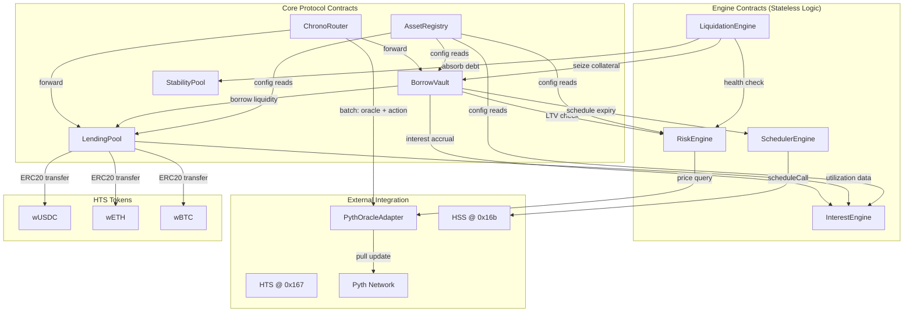
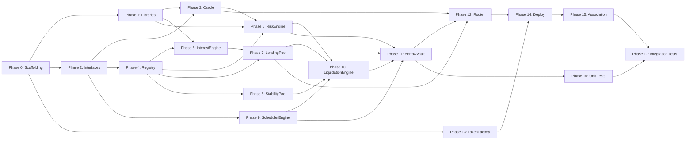

# Chrono Protocol — Hedera Implementation Plan

> Plan only. No code written yet.

---

## Current State

- Empty project with `contracts/` directory structure (subdirs exist, no `.sol` files)
- `node_modules/` present (partial prior install)
- No `package.json`, `hardhat.config.ts`, tests, or deploy scripts
- Whitepaper complete at [Chrono_Protocol_Whitepaper.md](file:///d:/MDG/personal_projects/chrono_hedera/Chrono_Protocol_Whitepaper.md)

---

## MVP Scope

- 3 HTS fungible tokens on testnet: **wUSDC**, **wETH**, **wBTC**
- Per-token **lending pools** + **stability pools**
- Core protocol: **borrow**, **lend**, **soft liquidation**, **hard liquidation**
- Single **Pyth pull oracle** for USD price feeds
- Modular: adding new wrapped currency = 1 registry call, zero redeployment

---

## Resolved Decisions

> [!NOTE]
> **1. Interest compounding granularity** — Whitepaper says "per block." Hedera has no fixed block time. **Resolved:** seconds-based (`block.timestamp` delta). No viable alternative on this host.

> [!NOTE]
> **2. Frontend scope** — **Resolved:** out of scope. Plan covers smart contracts, deploy scripts, and tests only.

> [!NOTE]
> **3. Close factor** — Whitepaper says flat 50%. **Resolved:** configurable per-market via `AssetRegistry`, default 50%.

> [!NOTE]
> **4. Governance parameters** — LTV base/max, decay `k`, rate slopes, `ltBuffer`, `hardLiqPenalty`, `liquidationBonus`, `closeFactor`. **Resolved:** all per-asset config in `AssetRegistry`, hardcoded MVP defaults, owner-only setters. Live governance module (voting, timelock, etc.) out of scope — structured so it can slot in later as the new `owner`.

> [!NOTE]
> **5. Toolchain** — **Resolved:** Hardhat 3 + TypeScript. Hedera's own HSS tutorials use Hardhat 3, and the Schedule Service precompile (`0x16b`) isn't available on a local network at all — testnet-integration flow is mandatory regardless of toolchain, and Hardhat 3 has first-party support for it (including running Foundry-style Solidity unit tests via `npx hardhat test solidity` alongside TS integration tests). Foundry alone would mean building that testnet-integration flow from scratch for the one subsystem the whitepaper calls mandatory (§5).

> [!NOTE]
> **6. §2.2 LTV table vs §2.3 formula** — Whitepaper's worked example table (90%/87%/84%/75% at 1hr/12hr/1day/7day) is **not reproducible** by a single constant `k` in the §2.3 exponential formula with base=70%/max=95% — the four points imply `k` values ranging from 0.0096 to 0.223, a 20x spread. **Resolved:** table treated as theoretical/illustrative, not a binding target. Formula stays exactly as written in §2.3 (linear `t`, no reshaping to fit the table). Per-asset `k`/base/max are free parameters, tuned from whatever real behavior the formula produces — not reverse-engineered to hit table numbers.
>
> **Default LTV parameters:** `base = 75%`, `max = 90%`. `k` calibrated so LTV decays to within 1% of base at 7 days: `k = ln(100) / 604800 ≈ 7.614e-6 per second` (WAD: `7_614_000_000_000`). **Time unit throughout protocol is seconds** (`block.timestamp` delta). Decay curve at these defaults:
> | Elapsed | LTV |
> |---------|-----|
> | 0 | 90.0% |
> | 1 day | 82.8% |
> | 3 days | 77.1% |
> | 7 days | 75.15% ≈ base |

> [!NOTE]
> **7. §2.4 dynamic `k` calibration** (`k = α·σ_30d + β`, from trailing volatility oracle) — **Resolved:** out of scope for MVP. `k` is static per-asset, hardcoded default, owner-settable. No volatility-feed subsystem built. Revisit under future governance module (see #4).

> [!NOTE]
> **8. `extendDuration` feature** — **Resolved:** scoped out of MVP. Extending a loan's duration lowers `maxLTV(t)` for the new duration, likely making the existing position under-collateralized. Handling that requires either forced collateral top-up or partial liquidation at extension time + HSS reschedule — significant new complexity not in original whitepaper. Users can repay and open a new position with desired duration instead. Revisit post-MVP.

> [!IMPORTANT]
> **Still open — no value yet, not inferable, need your input:**
> - `hardLiqPenalty` (hard liquidation protocol penalty, per-asset) — confirmed *per-asset configurable*, whitepaper §4.2 gives no number at all, no default chosen yet.

---

## Architecture Overview

### System Diagram



### Extensibility Model

Adding new asset (e.g., wSOL):
1. Deploy/mint HTS token via `WrappedTokenFactory`
2. Register Pyth price feed ID in `PythOracleAdapter`
3. Call `AssetRegistry.registerAsset()` with risk params

Zero protocol contract redeployment. All contracts read configs from registry.

---

## Contract Architecture

### Directory Layout

```
contracts/
├── interfaces/       # Pure interface definitions (9 files)
│   ├── IAssetRegistry.sol
│   ├── ILendingPool.sol
│   ├── IBorrowVault.sol
│   ├── IRiskEngine.sol
│   ├── IInterestEngine.sol
│   ├── ILiquidationEngine.sol
│   ├── IStabilityPool.sol
│   ├── ISchedulerEngine.sol
│   └── IOracleAdapter.sol
├── libraries/        # Shared math + data structures (3 files)
│   ├── MathLib.sol
│   ├── PositionLib.sol
│   └── ErrorLib.sol
├── oracle/           # External price feed adapter (1 file)
│   └── PythOracleAdapter.sol
├── core/             # Stateful protocol contracts (4 files)
│   ├── AssetRegistry.sol
│   ├── LendingPool.sol
│   ├── BorrowVault.sol
│   ├── StabilityPool.sol
│   └── ChronoRouter.sol
├── engines/          # Logic/computation engines (4 files)
│   ├── RiskEngine.sol
│   ├── InterestEngine.sol
│   ├── LiquidationEngine.sol
│   └── SchedulerEngine.sol
└── token/            # HTS token deployment (1 file)
    └── WrappedTokenFactory.sol
```

**Total: 22 Solidity files** (9 interfaces + 3 libraries + 10 implementations)

---

## Phase-by-Phase Implementation Plan

### Phase 0: Project Scaffolding

**Toolchain:** Hardhat 3 + TypeScript (resolved decision #5 above). Init via `npx hardhat --init`, select "Hardhat 3 → TypeScript Hardhat Project using Mocha and Ethers.js".

**Files created:**
- `package.json` — deps: hardhat 3.x, `@nomicfoundation/hardhat-toolbox-mocha-ethers`, ethers v6, `@hiero-ledger/hiero-contracts@^0.1.2`, `@openzeppelin/contracts@^5.1.0`, `@pythnetwork/pyth-sdk-solidity@^4.0.0`
- `hardhat.config.ts` — Solidity 0.8.24, optimizer on, Hedera testnet network (chain 296, Hashio RPC)
- `tsconfig.json`, `.env.example`, `.gitignore`

**Key decisions:**
- `@hiero-ledger/hiero-contracts` is correct npm package (not `@hashgraph/smart-contracts` — that's deprecated)
- Import paths: `@hiero-ledger/hiero-contracts/token-service/HederaTokenService.sol`, `@hiero-ledger/hiero-contracts/schedule-service/HederaScheduleService.sol`, `@hiero-ledger/hiero-contracts/common/HederaResponseCodes.sol`
- Hardhat 3 renames `compile` → `build`; project init is `npx hardhat --init` not `npx hardhat init`; secrets via built-in keystore plugin (`npx hardhat keystore set HEDERA_PRIVATE_KEY`) instead of raw `.env` for anything sensitive
- Solidity unit tests (Phase 16 subset) can run through Hardhat 3's native Foundry-compatible `npx hardhat test solidity` task where that's a better fit than Mocha/Chai — both test runners coexist in the same project

**Verification:** `npm install` + `npx hardhat build` (empty contracts dir, should succeed)

---

### Phase 1: Libraries

#### `MathLib.sol` — Fixed-point WAD (1e18) math
- `wadMul(a, b)`, `wadDiv(a, b)` — safe fixed-point ops
- `expNeg(x)` — compute `e^(-x)` via 6-term Taylor series (accurate for x in [0, 10])
- `computeLTV(ltvBase, ltvMax, k, tSeconds)` — whitepaper §2.3 equation: `LTV(t) = base + (max - base) * e^(-k*t)` where **`t` is in seconds** and **`k` is per-second** (both WAD-scaled). On-chain time unit is always seconds (`block.timestamp` delta).
- `computeBuffer(bufferMin, bufferMax, kBuf, tElapsedSeconds)` — dynamic liquidation buffer: `buffer(t) = bufferMin + (bufferMax - bufferMin) * (1 - e^(-k*t))`. Grows from `bufferMin` at borrow start to `bufferMax` over time. Same exponential shape as LTV decay, inverted (growth instead of decay). `t` = seconds elapsed since borrow, `k` = per-second.
- `kinkRate(utilization, rBase, uOptimal, rSlope1, rSlope2)` — whitepaper §6.2 two-phase model
- `compoundInterest(principal, annualRate, elapsedSeconds)` — second-order binomial approximation

#### `PositionLib.sol` — Position data structure
- `Position` struct: id, borrower, collateral/debt tokens, amounts, timestamps, scheduled tx address, active flag
- `HealthState` enum: SAFE, WARNING, LIQUIDATABLE, EXPIRED (whitepaper §3.2)
- Helper functions: `totalDebt()`, `remainingDuration()`, `durationHoursWad()`, `classifyHealth()`

#### `ErrorLib.sol` — Custom error definitions
- Organized by domain: Registry, Position, Risk, Pool, Oracle, Scheduler, Access
- All errors carry contextual parameters for debugging

**Verification:** Compiles in isolation. No external deps beyond Solidity builtins.

---

### Phase 2: Interfaces

9 interface files defining every module boundary. All protocol contracts implement their interface; external consumers depend only on interfaces.

Key signatures per interface:

| Interface | Key Functions |
|-----------|--------------|
| `IOracleAdapter` | `getPrice(token)`, `updatePrice(token, data)`, `getUpdateFee(data)` |
| `IAssetRegistry` | `registerAsset(config)`, `getConfig(token)`, `isSupported(token)` |
| `ILendingPool` | `deposit(token, amount)`, `withdraw(token, shares)`, `reserveBorrowLiquidity()`, `returnBorrowLiquidity()` |
| `IBorrowVault` | `openPosition(...)`, `repay(id, amount)`, `topUpCollateral(id, amount)` |
| `IRiskEngine` | `computeMaxLTV(token, duration)`, `computeHealthFactor(collValue, debtValue, token, duration)` |
| `IInterestEngine` | `getUtilization(token)`, `getBorrowAPY(token)`, `accrueInterest(positionId)` |
| `ILiquidationEngine` | `softLiquidate(id, amount, priceData)`, `executeHardLiquidation(id)` |
| `IStabilityPool` | `deposit(debtToken, amount)`, `absorbDebt(debtToken, amount, collToken, collAmount)` |
| `ISchedulerEngine` | `scheduleHardLiquidation(id, expiry)`, `cancelSchedule(id)` |

**Verification:** Compiles. No implementation deps.

---

### Phase 3: PythOracleAdapter

**Purpose:** Wrap Pyth pull oracle behind `IOracleAdapter`. Single contract handles all price feeds.

**Implementation details:**
- Constructor takes Pyth contract address (Hedera testnet — check [pyth.network/developers/evm](https://pyth.network/developers/evm) for current address)
- `registerPriceFeed(token, bytes32 pythFeedId)` — owner maps HTS token address to Pyth feed
- `getPrice(token)` — calls `pyth.getPriceUnsafe()`, checks staleness (configurable, default 120s), reverts if negative, normalizes to WAD
- `updatePrice(token, priceUpdateData)` — calls `pyth.updatePriceFeeds{value: fee}()`, refunds excess HBAR
- WAD normalization: Pyth returns `(int64 price, int32 expo)`. Adapter converts to 1e18 scale.
- Inherits `Ownable` for feed registration

**Pyth feed IDs (same testnet + mainnet):**

| Asset | Feed ID |
|-------|---------|
| BTC/USD | `0xe62df6c8b4a85fe1a67db44dc12de5db330f7ac66b72dc658afedf0f4a415b43` |
| ETH/USD | `0xff61491a931112ddf1bd8147cd1b641375f79f5825126d665480874634fd0ace` |
| USDC/USD | `0xeaa020c61cc479712813461ce153894a96a6c00b21ed0cfc2798d1f9a9e9c94a` |

**Hedera-specific note:** Hedera EVM uses 8 decimal places for HBAR, not 18. All math uses WAD (1e18) internally — conversion only needed if involving native HBAR, which MVP does not.

**Verification:** Unit test with mock Pyth contract. Test normalization math, staleness revert, negative price revert.

---

### Phase 4: AssetRegistry

**Purpose:** Central config store. Adding new asset = single `registerAsset()` call.

**`AssetConfig` struct fields:**
- `tokenAddress`, `decimals`, `isStablecoin`
- `ltvBase` (WAD, default 75%), `ltvMax` (WAD, default 90%), `kDecay` (WAD, **per-second**, default `7_614_000_000_000` ≈ 7.614e-6/s) — static per-asset, §2.4 dynamic calibration deferred (resolved decision #7). **Time unit: seconds.** If pool creator omits these on `registerAsset()`, contract fills defaults: base=75%, max=90%, k=7.614e-6/s (decays to ~base in 7 days).
- `liquidationBonus` (WAD, e.g. 5%), `closeFactor` (WAD, default 50%, per-market configurable per resolved decision #3)
- `ltBufferMin` (WAD, default 5%) — liquidation threshold buffer at borrow start (t=0 elapsed). Per-asset configurable.
- `ltBufferMax` (WAD, default 25%) — liquidation threshold buffer asymptote. Per-asset configurable.
- `kLtBuffer` (WAD, **per-second**, default `7_614_000_000_000` ≈ 7.614e-6/s) — buffer growth rate. Default same as `kDecay` (99% growth in 7 days). Formula: `buffer(t_elapsed) = ltBufferMin + (ltBufferMax - ltBufferMin) * (1 - e^(-kLtBuffer * t_elapsed))`. Buffer curve at defaults:
  | Elapsed | Buffer |
  |---------|--------|
  | 0 | 5.0% |
  | 1 day | 14.6% |
  | 3 days | 22.2% |
  | 7 days | 24.8% ≈ 25% |
- `hardLiqPenalty` (WAD) — **new field.** Flat protocol penalty applied on hard liquidation (whitepaper §4.2 names this but gives no number). Per-asset configurable (resolved decision #4). **Default value: TBD, not yet set.**
- `maxBorrowDuration` (seconds), `minBorrowDuration` (seconds, default 3600 = 1 hour)
- `isActive` flag

**Functions:** `registerAsset()`, `updateAssetConfig()`, `deactivateAsset()`, `getConfig()`, `isSupported()`, `getAllAssets()`

**Access:** Owner-only for mutations. Events on all state changes.

**Default configs for MVP:**

| Asset | Stablecoin | LTV Base | LTV Max | k Decay (/s) | Liq Bonus | Close Factor | LT Buf Min | LT Buf Max | k LT Buf (/s) | Hard Liq Penalty | Min Duration | Max Duration |
|-------|-----------|----------|---------|-------------|-----------|-------------|------------|------------|---------------|-----------------|-------------|-------------|
| wBTC | No | 75% | 90% | 7.614e-6 | 5% | 50% | 5% | 25% | 7.614e-6 | **TBD** | 1 hour | 7 days |
| wETH | No | 75% | 90% | 7.614e-6 | 5% | 50% | 5% | 25% | 7.614e-6 | **TBD** | 1 hour | 7 days |
| wUSDC | Yes | 80% | 97% | 7.614e-6 | 3% | 50% | 5% | 25% | 7.614e-6 | **TBD** | 1 hour | 30 days |

LTV base/max/k values above are MVP defaults (resolved decision #6). `k` calibrated so that `e^(-k * 604800) ≈ 0.01`, meaning 99% decay in 7 days. When `registerAsset()` is called without explicit params, these defaults apply. All `k` values stored and computed in **seconds** — `block.timestamp` is the on-chain clock. LT buffer uses same k by default (99% growth in 7 days).

**Verification:** Unit test register, query, deactivate, duplicate revert.

---

### Phase 5: InterestEngine

**Purpose:** Whitepaper §6 two-phase kink rate model. Tracks and accrues interest per position.

**Hardcoded rate parameters (from whitepaper §6.3):**

| Param | Stablecoin | Volatile |
|-------|-----------|----------|
| r_base | 0.5% | 1.5% |
| U_optimal | 90% | 80% |
| r_slope1 | 4% | 6% |
| r_slope2 | 60% | 100% |

**Key functions:**
- `getUtilization(token)` — reads `LendingPool.getTotalBorrowed()` / `getTotalDeposits()`
- `getBorrowAPY(token)` — applies kink formula using `MathLib.kinkRate()`
- `getSupplyAPY(token)` — `borrowAPY * utilization * (1 - protocolFee)`
- `accrueInterest(positionId)` — `block.timestamp` delta, applies `MathLib.compoundInterest()`
- `initPosition()`, `updateAfterRepay()`, `clearPosition()` — lifecycle hooks

**Access:** `BorrowVault` and `LiquidationEngine` authorized as callers. One-time `setAuthorized()`.

**Internal state:** Per-position mappings for `lastAccrualTime`, `accruedInterest`, `debtPrincipal`, `positionDebtToken`.

**Verification:** Unit test rate output matches whitepaper §6.3 table values. Test compounding over time intervals.

---

### Phase 6: RiskEngine

**Purpose:** Stateless computation. Whitepaper §2.3 (LTV decay) and §3.1 (health factor).

**`computeMaxLTV(token, durationSeconds)`:**
1. Read `AssetConfig` from registry
2. Validate duration within `[minBorrowDuration, maxBorrowDuration]`
3. Convert `durationSeconds` to WAD-scaled seconds (multiply by 1e18)
4. Apply `MathLib.computeLTV(base, max, k, tSeconds)` — `k` is per-second (WAD), `t` is seconds (WAD). Returns WAD.

**`computeHealthFactor(collateralValue, debtValue, collateralToken, remainingDuration, elapsedSeconds)`:**
1. If debtValue == 0, return `type(uint256).max`
2. Compute dynamic buffer: `buf = MathLib.computeBuffer(config.ltBufferMin, config.ltBufferMax, config.kLtBuffer, elapsedSeconds)` — grows from 5% to 25% over time elapsed since borrow
3. Compute liquidation threshold: `LT = maxLTV(remainingDuration) + buf` (capped at 100%)
4. `HF = (collateralValue * LT) / debtValue` via WAD math

**Verification:** No table-matching assertion (resolved decision #6 — §2.2 table is illustrative, not binding). Instead, property-based tests against whatever `base`/`max`/`k` are actually configured:
- `LTV(0) == ltvMax`
- `LTV(t) → ltvBase` as `t` grows large
- Strictly monotonic decreasing in `t`
- Output matches direct evaluation of §2.3's formula (`base + (max-base)*e^(-k*t)`) for spot-checked `t` values, within rounding tolerance

---

### Phase 7: LendingPool

**Purpose:** Per-asset liquidity pools. Lenders deposit, receive proportional shares (internal accounting, no LP token mint for MVP).

**Pool state per token:** `totalDeposits`, `totalBorrowed`, `totalShares`

**Lender operations:**
- `deposit(token, amount)` — ERC20 `transferFrom`, compute shares (amount * totalShares / totalDeposits, or 1:1 for first deposit), update state
- `withdraw(token, shares)` — compute token amount (shares * totalDeposits / totalShares), check available liquidity, transfer out

**Protocol operations (authorized only — BorrowVault, LiquidationEngine):**
- `reserveBorrowLiquidity(token, amount)` — increase `totalBorrowed`, check available
- `returnBorrowLiquidity(token, amount)` — decrease `totalBorrowed`

**Hedera-specific:** HTS tokens on Hedera EVM expose ERC-20 interface. Standard `IERC20.transferFrom()` works. Contract must associate with each token before receiving — handle in deployment step.

**Reentrancy:** `deposit`/`withdraw` carry `nonReentrant` (OZ `ReentrancyGuard`) — external token transfer + state update in same call.

**Verification:** Deposit/withdraw share math, liquidity availability checks, unauthorized access reverts.

---

### Phase 8: StabilityPool

**Purpose:** Per-debt-token pool. Providers deposit debt tokens. During soft liquidation, pool absorbs bad debt, providers receive pro-rata collateral.

**Reward tracking:** Cumulative reward-per-deposit ratio pattern (similar to Synthetix staking):
- On `absorbDebt()`: increment `cumulativeRewardPerDeposit[collateralToken]` by `collateralAmount / totalDeposits`
- On deposit/withdraw: snapshot pending rewards for provider based on delta between current and last-seen cumulative

**Functions:**
- `deposit(debtToken, amount)`, `withdraw(debtToken, amount)` — provider operations
- `absorbDebt(debtToken, debtAmount, collateralToken, collateralAmount)` — called by LiquidationEngine only. Burns debt from pool, receives collateral.
- `claimCollateralRewards(debtToken)` — provider claims accumulated collateral across all token types
- `canAbsorb(debtToken, amount)` — view check

**Reentrancy:** `deposit`, `withdraw`, `claimCollateralRewards` carry `nonReentrant`.

**Verification:** Test absorption math, pro-rata distribution across multiple providers, claim after multiple liquidation events.

---

### Phase 9: SchedulerEngine

**Purpose:** Wrap HSS HIP-1215 `scheduleCall` for deterministic hard liquidation at `T_expiry`.

**This is the core Hedera-native innovation — keeperless, autonomous position expiry.**

**Implementation:**
- Inherits `HederaScheduleService` (from `@hiero-ledger/hiero-contracts/schedule-service/`)
- `scheduleHardLiquidation(positionId, expiryTimestamp)`:
  1. Encode calldata: `abi.encodeCall(ILiquidationEngine.executeHardLiquidation, (positionId))`
  2. Check capacity: `hasScheduleCapacity(expiryTimestamp, GAS_LIMIT)`
  3. If `SCHEDULE_EXPIRY_IS_BUSY`: retry with +1 second jitter, up to 5 attempts
  4. Call `scheduleCall(liquidationEngine, expiryTimestamp, gasLimit, 0, callData)`
  5. Verify `responseCode == SUCCESS && scheduleAddress != address(0)`
  6. Store `scheduleAddress` mapped to position ID
- `cancelSchedule(positionId)` — `deleteSchedule(storedAddress)` on early repayment

**HSS-specific constraints:**
- `scheduleCall` is non-reverting — always check return code
- `expirySecond` serves as both earliest execution time AND expiration deadline
- Contract must hold HBAR for gas at execution time — needs `receive() payable` + admin funding

**Verification:** Hard to unit test without Hedera network. Integration test on testnet: schedule call 60 seconds in future, verify execution.

---

### Phase 10: LiquidationEngine

**Purpose:** Whitepaper §4 dual-path liquidation.

**Soft Liquidation (`softLiquidate(positionId, repayAmount, priceUpdateData)`):**
1. Update oracle prices (Pyth pull)
2. Accrue interest on position via `InterestEngine`
3. Compute health factor via `RiskEngine` — require `HF ≤ 1.0`
4. Cap `repayAmount` at `closeFactor * totalDebt` (from AssetRegistry)
5. Compute collateral to seize: `(repayAmount * debtPrice * (1 + liquidationBonus)) / collateralPrice`
6. **First try stability pool:** if `StabilityPool.canAbsorb()`, call `absorbDebt()` — instant settlement
7. **Fallback:** external liquidator repays debt via ERC20 transfer, receives seized collateral
8. Update interest tracking, emit event

**Hard Liquidation (`executeHardLiquidation(positionId)`):**
1. Called by HSS scheduled tx at `T_expiry` (or anyone after expiry)
2. **Guard:** require `position.active == true` — blocks double-liquidation if a soft liquidation already cleared this position between scheduling and `T_expiry` firing (race condition, see below)
3. Require `block.timestamp >= expiryTimestamp`
4. Accrue final interest
5. Full collateral liquidation: cover debt + accrued interest + `AssetRegistry.getConfig(debtToken).hardLiqPenalty` (per-asset, not hardcoded — resolved decision #4)
6. Return any excess collateral to borrower
7. Clear position (`active = false`) + interest tracking
8. Emit event

**Soft/hard liquidation race:** a position can cross `HF ≤ 1.0` shortly before `T_expiry`. If soft-liquidated first, the position closes (`active = false`) before the HSS scheduled call fires — step 2's guard makes the later `executeHardLiquidation` call a no-op revert instead of double-processing an already-cleared position.

**Access:** Soft liquidation is permissionless (anyone can liquidate). Hard liquidation callable by anyone post-expiry (HSS triggers it deterministically, but manual fallback exists).

**Reentrancy:** `softLiquidate` and `executeHardLiquidation` both move tokens (debt repayment, collateral seizure) — both carry `nonReentrant` (OZ `ReentrancyGuard`).

**Verification:** Unit test close factor cap, bonus math, stability pool priority, hard liquidation excess return, double-liquidation guard (soft-liq then attempt hard-liq on same position reverts cleanly).

---

### Phase 11: BorrowVault

**Purpose:** Core entry point for borrowers. Position lifecycle management.

**`openPosition(collateralToken, debtToken, collateralAmount, borrowAmount, durationSeconds)`:**
1. Validate both tokens in `AssetRegistry`
2. `RiskEngine.computeMaxLTV(collateralToken, durationSeconds)` — get max allowed
3. `PythOracleAdapter.getPrice()` for both tokens
4. Compute requested LTV: `(borrowAmount * debtPrice) / (collateralAmount * collateralPrice)`
5. Require `requestedLTV ≤ maxLTV`
6. `IERC20.transferFrom()` collateral from borrower
7. `LendingPool.reserveBorrowLiquidity(debtToken, borrowAmount)`
8. `IERC20.transfer()` borrowed tokens to borrower
9. Create `Position` struct, store
10. `InterestEngine.initPosition()`
11. `SchedulerEngine.scheduleHardLiquidation(positionId, expiryTimestamp)` — store schedule address
12. Emit `PositionOpened`

**`repay(positionId, amount)`:**
1. `InterestEngine.accrueInterest()` — get total debt
2. Cap at total debt
3. Transfer debt tokens from borrower, return to `LendingPool`
4. `InterestEngine.updateAfterRepay()`
5. If fully repaid: return collateral, `SchedulerEngine.cancelSchedule()`, close position

**`topUpCollateral(positionId, amount)`:** — add collateral, improve HF


**Reentrancy:** `openPosition`, `repay`, `topUpCollateral` carry `nonReentrant` — each moves tokens then updates position state.

**Verification:** Full lifecycle test: open, partial repay, top-up, full repay. LTV rejection test.

---

### Phase 12: ChronoRouter

**Purpose:** Convenience. Batch Pyth oracle update + protocol action in one tx.

**Functions:**
- `openPositionWithPriceUpdate(priceData, collateral, debt, amounts, duration)`
- `depositWithPriceUpdate(priceData, token, amount)`
- `repayWithPriceUpdate(priceData, positionId, amount)`

Each: update oracle first, then forward to core contract. Handles ERC20 approval flow (transferFrom user to router, approve to target).

**Reentrancy:** all three entry points carry `nonReentrant` — router holds funds mid-flow during the transferFrom/approve/forward sequence.

**Verification:** Integration test — single tx deposits + borrows with stale oracle.

---

### Phase 13: WrappedTokenFactory

**Purpose:** Create 3 HTS fungible tokens on testnet via HTS precompile (0x167).

**Inherits:** `HederaTokenService`, `KeyHelper`, `ExpiryHelper`

**`createWrappedToken(name, symbol, decimals, initialSupply)`:**
1. Build `IHederaTokenService.HederaToken` struct — treasury = contract, auto-renew 90 days
2. Set SUPPLY key to contract address (enables minting)
3. Call `createFungibleToken(token, initialSupply, decimals)` — **internal** call, `msg.value` forwarded to precompile automatically
4. Store token address by symbol

**Hedera-specific details:**
- `createFungibleToken` is `internal` in `HederaTokenService.sol` — do NOT use `{value: msg.value}` syntax (compile error). Function already forwards `msg.value` to precompile internally.
- Calling function must be `payable` — token creation costs ~15-20 HBAR
- Response code 22 = SUCCESS from `HederaResponseCodes`

**Tokens to create:**

| Token | Symbol | Decimals | Initial Supply |
|-------|--------|----------|---------------|
| Wrapped USDC | wUSDC | 8 | 1,000,000 |
| Wrapped ETH | wETH | 8 | 1,000 |
| Wrapped BTC | wBTC | 8 | 100 |

**Additional functions:** `mint(token, amount)` (testnet utility), `distributeTokens(token, recipient, amount)`

**Verification:** Deploy to testnet, verify token creation on HashScan. Test mint/distribute.

---

### Phase 14: Deployment Pipeline

Ordered 5-step deployment script (`scripts/deploy/deploy.ts`):

| Step | Action | Contracts/Calls |
|------|--------|-----------------|
| 1 | Deploy token factory, create 3 tokens | `WrappedTokenFactory`, `createWrappedToken` x3 |
| 2 | Deploy oracle, register price feeds | `PythOracleAdapter`, `registerPriceFeed` x3 |
| 3 | Deploy all protocol contracts | `AssetRegistry`, `LendingPool`, `InterestEngine`, `RiskEngine`, `StabilityPool`, `SchedulerEngine`, `LiquidationEngine`, `BorrowVault`, `ChronoRouter` |
| 4 | Wire authorizations | `LendingPool.setAuthorized(BorrowVault, LiquidationEngine)`, `InterestEngine.setAuthorized(BorrowVault, LiquidationEngine)`, `StabilityPool.setLiquidationEngine()`, `SchedulerEngine.initialize()`, `LiquidationEngine.initialize()` |
| 5 | Register assets in registry | `AssetRegistry.registerAsset()` x3 with risk params |

**Output:** Save all deployed addresses to `deployments/testnet.json`.

**Post-deploy:** Fund SchedulerEngine with HBAR for scheduled tx gas. Associate protocol contracts with HTS tokens.

---

### Phase 15: Token Association

**Hedera-specific step.** Every contract that receives HTS tokens must call `associateToken(address(this), tokenAddress)` for each token.

Contracts needing association:
- `LendingPool` — receives all 3 tokens from lenders
- `BorrowVault` — receives collateral tokens
- `StabilityPool` — receives debt tokens + collateral from liquidations
- `LiquidationEngine` — temporarily holds tokens during liquidation
- `ChronoRouter` — relays tokens

Either: (a) add `associateToken` calls in contract constructors/initializers, or (b) call via deployment script post-deploy.

Plan: Option (b) — keep contracts clean, handle association in deployment step 4.5.

---

### Phase 16: Unit Tests

**Framework:** Hardhat + Chai + ethers v6

| Test File | Covers | Key Assertions |
|-----------|--------|----------------|
| `RiskEngine.test.ts` | LTV decay curve | Boundary values (`t=0`→max, `t→∞`→base), strict monotonicity, formula matches §2.3 directly — no §2.2 table matching (resolved decision #6) |
| `InterestEngine.test.ts` | Kink rate model | Rate at 0%, 80%, 90%, 100% utilization matches §6.3 |
| `MathLib.test.ts` | WAD math, expNeg Taylor | `expNeg(0) = WAD`, `expNeg(WAD) ≈ 0.368 WAD`, overflow safety |
| `LendingPool.test.ts` | Share accounting | Deposit/withdraw roundtrip, multi-depositor proportionality, reentrancy revert |
| `BorrowVault.test.ts` | Position lifecycle | Open, repay, LTV rejection, duration bounds, reentrancy revert |
| `LiquidationEngine.test.ts` | Dual liquidation | Close factor cap, bonus math, stability pool priority, double-liquidation guard, reentrancy revert |
| `StabilityPool.test.ts` | Debt absorption | Pro-rata distribution, multi-provider, reward claim, reentrancy revert |

**Mock strategy:** Mock `PythOracleAdapter` and `SchedulerEngine` for unit tests (they depend on Hedera-specific precompiles that don't exist in Hardhat local network).

---

### Phase 17: Integration Tests (Testnet) [COMPLETED]

**Environment:** Hedera testnet via `--network testnet`

| Test File | Scenario |
|-----------|----------|
| `BorrowFlow.test.ts` | Full deposit-borrow-repay cycle with live Pyth oracle updates |
| `SoftLiquidation.test.ts` | Open position, push stale high price, update to lower price, trigger liquidation |
| `HardLiquidation.test.ts` | Open short-duration position (5 min), wait for HSS scheduled tx to fire |
| `TokenFactory.test.ts` | Create token, mint, distribute, verify on mirror node |

---

## Implementation Order & Dependency Graph



**Critical path:** P0 → P1/P2 → P4 → P5/P6 → P7 → P10 → P11 → P14

---

## Key Design Decisions

| Decision | Options Considered | Choice | Rationale |
|----------|-------------------|--------|-----------|
| Token standard | HTS native vs ERC-20 deploy | HTS native via precompile | Lower cost, native compliance controls, required for HTS-specific features |
| Oracle | Chainlink vs Pyth vs custom | Pyth pull | Deployed on Hedera testnet, pull model = fresher prices, lower gas when idle |
| Hard liquidation trigger | Off-chain keeper vs HSS `scheduleCall` | HSS HIP-1215 | Keeperless, deterministic, core whitepaper requirement. Non-obvious Hedera service usage. |
| LP tokens | Mint HTS LP token vs internal shares | Internal share accounting | MVP simplicity, avoids extra token association overhead |
| Architecture | Monolith vs Diamond proxy vs modular | Modular separate contracts | Clean interfaces, independent testability, each module deployable/upgradeable independently |
| New asset onboarding | Redeploy vs registry pattern | Registry pattern | Single tx to add asset, zero redeployment |
| Interest compounding | Per-block vs per-second | Per-second (`block.timestamp` delta) | Hedera has no fixed block time, `block.timestamp` is deterministic |
| Toolchain | Hardhat 3 vs Foundry | Hardhat 3 + TS, Foundry-style Solidity tests where useful | HSS precompile (0x16b) unavailable locally either way — testnet integration is mandatory; Hardhat 3 has first-party support for that exact flow |
| `k` calibration | Static per-asset vs live §2.4 dynamic formula | Static per-asset, owner-settable | Dynamic calc needs a volatility-feed subsystem — deferred to future governance module |
| LTV table vs formula | Reshape formula to hit §2.2 numbers vs keep formula as-is | Keep §2.3 formula as-is | §2.2 table is unreproducible by any single constant `k` — treated as illustrative, not a spec target |

---

## Security Considerations (MVP Scope)

**In scope:**
- **Reentrancy** — `nonReentrant` (OZ `ReentrancyGuard`) on every external function that moves tokens: `LendingPool.deposit/withdraw`, `BorrowVault.openPosition/repay/topUpCollateral`, `LiquidationEngine.softLiquidate/executeHardLiquidation`, `StabilityPool.deposit/withdraw/claimCollateralRewards`, `ChronoRouter`'s three entry points.
- **Soft/hard liquidation race** — `executeHardLiquidation` checks `position.active` before processing, so a position already closed by soft liquidation can't be double-liquidated when the HSS scheduled call fires afterward.
- **Access control** — owner-only mutation on `AssetRegistry`, authorized-caller pattern on `LendingPool`/`InterestEngine` protocol-only functions (`BorrowVault`, `LiquidationEngine`).
- **HSS non-reverting calls** — `scheduleCall`/`hasScheduleCapacity` return codes always checked explicitly (Hedera-specific gotcha #4 below).

**Explicitly out of scope for MVP** (per your steer — obvious protocol-level issues handled, complex exploit modeling deferred):
- Oracle price manipulation / flash-loan-assisted attacks on the LTV or liquidation math
- MEV / sandwich modeling around liquidation or oracle update transactions
- Economic griefing (e.g. dust positions, gas-limit griefing on scheduled calls at scale)
- Formal verification / invariant fuzzing beyond the unit tests listed in Phase 16

---

## Hedera-Specific Gotchas to Handle

1. **Token association** — contracts must associate before receiving HTS tokens
2. **`createFungibleToken` is `internal`** — no `{value: msg.value}` syntax on call; `msg.value` forwarded internally
3. **HSS throttling** — `SCHEDULE_EXPIRY_IS_BUSY` at high volume; need jitter retry pattern
4. **HSS non-reverting** — `scheduleCall` returns error code, does not revert; always check
5. **Pyth decimal normalization** — Pyth returns `(int64, int32 expo)`, not WAD
6. **HBAR 8 decimals** — Hedera EVM native token precision differs from Ethereum's 18; irrelevant for MVP (all WAD internally) but matters if ever handling HBAR directly
7. **Response code 22** — HTS/HSS SUCCESS is `int 22`, not boolean

---

## Estimated File Count

| Category | Files | Lines (est.) |
|----------|-------|-------------|
| Interfaces | 9 | ~300 |
| Libraries | 3 | ~350 |
| Core contracts | 5 | ~700 |
| Engine contracts | 4 | ~650 |
| Token factory | 1 | ~100 |
| Deploy scripts | 1 | ~200 |
| Unit tests | 7 | ~800 |
| Integration tests | 4 | ~400 |
| Config files | 5 | ~80 |
| **Total** | **39** | **~3,580** |